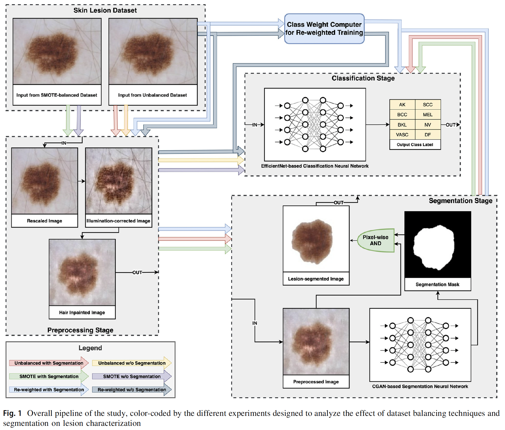

# Skin Lesion Characterization

Analysis of Dermoscopic Skin Lesion Images to segment lesion regions and characterize the lesion type using deep adversarial learning (conditional GANs) and EfficientNet-based classifiers.

## Quick links

- [Online research article [Springer Nature, HTML]](https://doi.org/10.1007/s00521-024-09964-9).
- [Published manuscript [PDF]](./assets/manuscript.pdf).
- [Data directory organization [Markdown]](./datasets/README.md) (internal reference).

## Cite Us

[Link to the Research Paper](https://doi.org/10.1007/s00521-024-09964-9).

If you find our work useful in your research, please cite us:

```
@article{kd2024conditional,
  title={Conditional adversarial segmentation and deep learning approach for skin lesion sub-typing from dermoscopic images},
  author={Mirunalini, P and Desingu, Karthik and Aswatha, S and Deepika, R and Deepika, V and Jaisakthi, SM},
  journal={Neural Computing and Applications},
  pages={1--19},
  year={2024},
  publisher={Springer}
}
```

## Study design overview

The different choices of data balancing and segmentation approaches used to augment the skin lesion characterization pipeline are presented in the following schematic. 



## Dataset balancing and lesion segmentation

The dataset balancing analysis and lesion segmentation network is contained in [`notebooks`](./notebooks). The python notebooks are sequentially numbered; simply run them serially to reproduce the presented experiments.

## Scaling experiments for classification

The classification architectures for classifiers are scripted in [`src/classifiers`](./src/classifiers). The preprocessing workflow used to prepare the dataset is contained in [`model-building`](.//model-building).

- Load the appropriate classifier driver function, say `experiment_effnetb6` (refer to the `.py` files and `import` statements), in [`src/run.py`](./src/run.py) by importing them.
- Set up the data path.
- Call the driver function in [`src/run.py`](./src/run.py), and execute the script with `python run.py`.

----    

## Environment setup

Set up the execution environment using the requirement files.
- Requirements for setting up **conda environment** are contained in `dep-file-conda.yml`.
- Requirements for setting up using **pip installations** (not recommended) are contained in `dep-file-pip.txt`.

> [!Note]
> The proprietary segmentation dataset generated with the help of expert pathologists used will be released upon reasonable request after the research manuscript is published.
